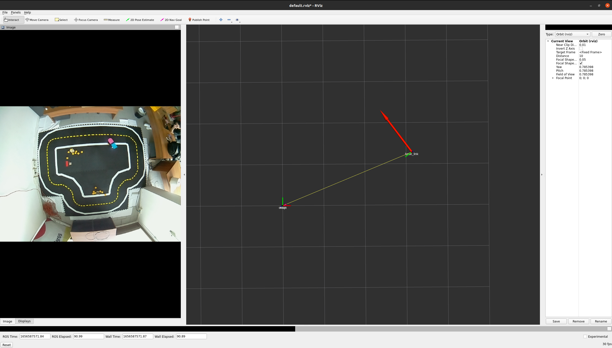

# Poliautolab

Politecnico di Milano Duckietown Autolab.

Localization for our watchtower.

The node localization/watcher.py publishes a msg of type DuckPose on /watchtower00/localization".
The sertvice getmap_server provides the description of the map. 

To use install the duckietown shell DTS and run the following command:
```
dts devel build -f
```
```
dts devel run
```
To open rviz open another terminal using
```
dts start_gui_tools
```
Based on ROS, find the scripts inside packages/localization


